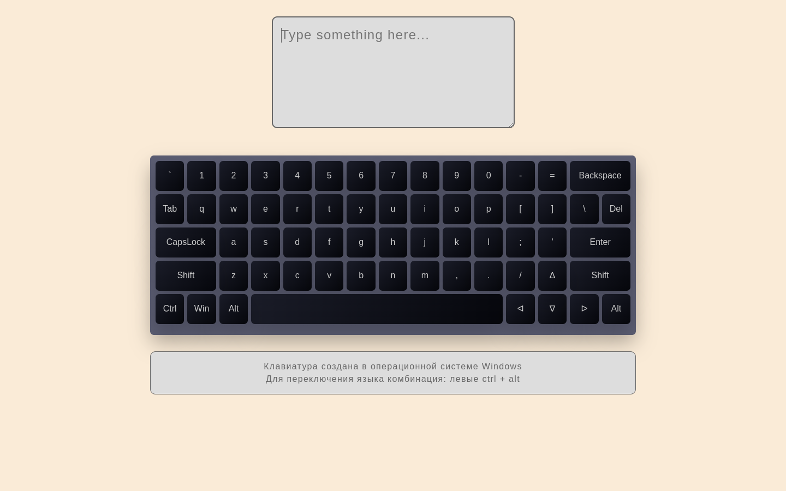

# virtual-keyboard
### Task:

https://github.com/rolling-scopes-school/tasks/blob/master/tasks/virtual-keyboard/virtual-keyboard-en.md
### App screenshot:

### Deploy:

https://Piotr-reader.github.io/virtual-keyboard

### Done 07.05.22 (deadline 10.05.22)
### Score: 110 / 110
